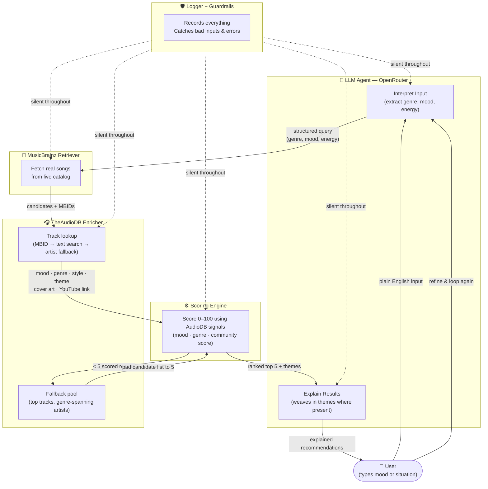

# Moodwave — AI Music Recommender

> Natural language mood input → LLM extraction → MusicBrainz + AudioDB enrichment → deterministic scoring → top 5 picks with LLM explanation.

---

## Original Project — AI Music Recommender (Modules 1–3 Simulation)

The earlier version of this project was a rule-based simulation with no external data or AI calls: a hardcoded 18-song CSV scored against a user's stated genre, mood, and energy preferences using simple weighted arithmetic. It demonstrated the core recommendation logic in isolation, treating the catalog as a fixed Python list and the "AI" as a handful of conditional multipliers (+2.0 for genre match, +1.0 for mood, up to +3.0 for energy proximity). Modules 1–3 built and iterated on that scoring engine before the architecture was rebuilt around real data and language models.

---

## Moodwave

A Streamlit web app that turns a plain-English mood description into five real, scored song recommendations with a natural-language explanation of why each one fits.

**How it works:** The user types anything — a feeling, a moment, a situation. A first LLM call (via OpenRouter) extracts a structured `MoodProfile`: genre, mood tag, energy level, valence, tempo, acoustic preference, and search keywords. Those attributes drive a live query against the MusicBrainz open catalog, pulling real tracks. Each candidate is then enriched via TheAudioDB — a free open catalog that maps MusicBrainz IDs to mood, genre, style, and theme metadata, and provides YouTube links and cover art. A deterministic scoring engine re-ranks the retrieved candidates against the profile and surfaces the top 5. A second LLM call receives the original input, the extracted profile, and the ranked results, then writes a cohesive explanation of why those songs fit the user's moment. The user can then refine the description and loop.

**Why it matters:** Natural language is the right interface for something as personal as music taste — no dropdowns, no genre checkboxes. Using a real catalog instead of synthetic data means every recommendation is an actual song that exists. Keeping the scoring logic outside the LLM makes the ranking transparent and reproducible: score reasons are readable directly in the UI, and the output does not change between runs for the same input.

---

## Architecture Overview

The pipeline has seven sequential stages with a cross-cutting logger active at every step.

1. **Guardrails / Input Validation** — Raw text is checked before anything else. Malformed or empty input is rejected with a user-facing warning and recorded to the log.
2. **LLM Interpretation — Call 1** — The validated text is sent to an OpenRouter-hosted model, which returns a structured `MoodProfile` containing genre, mood, energy (0–1), valence (0–1), tempo, acoustic flag, and a list of search keywords.
3. **MusicBrainz Retrieval (RAG step)** — The profile's keywords and genre drive a live query against the MusicBrainz REST API, fetching up to 25 real candidate tracks with title, artist, and duration. No authentication is required.
4. **AudioDB Enrichment** — Each MusicBrainz candidate is looked up in TheAudioDB by its recording ID, adding mood, genre, style, theme, community score, YouTube link, and cover art to the candidate. A text-search fallback handles missing IDs; an artist-level fallback covers gaps in track data. If fewer than 5 candidates survive scoring, a pre-enriched fallback pool (top tracks from genre-spanning artists) is used to pad results.
5. **Scoring Engine** — A deterministic re-ranker scores each candidate 0–100 using AudioDB mood and genre signals when available, falling back to MusicBrainz tags. Community score adds a small popularity bonus. No LLM is involved; scores are reproducible and the reasoning is exposed in the UI.
6. **LLM Explanation — Call 2** — The original mood text, the extracted profile, and the top 5 ranked songs (including their emotional themes where available) are sent to the LLM, which writes a cohesive paragraph explaining why the picks fit the user's moment.
7. **Refinement Loop** — After results are shown, the user can submit a follow-up description. The entire pipeline reruns from Stage 1 with the new input.

The logger runs silently alongside every stage, recording inputs, profile extractions, retrieval counts, ranked scores, and any errors.



---

## Setup Instructions

**Prerequisites:** Python 3.11+, an [OpenRouter](https://openrouter.ai) account (free tier works).

```bash
# 1. Clone the repository
git clone <your-repo-url>
cd AI-music-reco

# 2. Create and activate a virtual environment
python -m venv .venv
# macOS / Linux:
source .venv/bin/activate
# Windows:
.venv\Scripts\activate

# 3. Install dependencies
pip install -r requirements.txt

# 4. Configure your API key
cp .env.example .env
# Open .env and replace `your_key_here` with your OpenRouter API key.
# Get one at: https://openrouter.ai/keys

# 5. Run the app
streamlit run app.py
```

The app opens at `http://localhost:8501`. No other services, accounts, or local databases are required.

---

## Demo

[](https://www.loom.com/share/9ed3a98bfb924c6c83ec35b45a71dd35)

The walkthrough covers three end-to-end examples: a mellow late-night input, an upbeat in-love input, and a guardrails rejection. Each shows the full pipeline — mood profile extraction, catalog retrieval, enrichment, scoring breakdown, and LLM explanation.

---

## Design Decisions

**MusicBrainz over Spotify** — The Spotify API requires OAuth app registration, per-user authorization flows, and scope approval for search. MusicBrainz is fully open, requires no authentication, and returns real track metadata via a simple REST call. For a project focused on the AI pipeline rather than streaming integration, eliminating the auth wall meant faster iteration and a simpler deployment story.

**MusicBrainz + TheAudioDB as complementary catalogs** — MusicBrainz is the right source for track discovery: open, unauthenticated, full-text searchable across millions of recordings. But it returns almost no mood or genre metadata per track — its tags are user-curated and genre-heavy, not mood-heavy. TheAudioDB fills that gap exactly: every track response includes `strMood`, `strGenre`, `strStyle`, and `strTheme`, plus YouTube links and cover art. The two APIs are linked by MusicBrainz recording IDs, which TheAudioDB includes on every track object, so enrichment is exact with no text-matching ambiguity. Neither API requires authentication or payment.

**Two-LLM-call pattern** — Extraction and explanation are intentionally separate calls with separate prompts. The first call has a narrow, structured job: parse natural language into a typed `MoodProfile`. The second has a creative job: write a human-readable explanation given already-ranked results. Merging them into one call would make the prompt harder to tune, harder to debug, and would require the model to implicitly perform ranking — which it should not do.

**Deterministic scoring engine** — The re-ranking step uses explicit weighted arithmetic against profile attributes, not LLM judgment. This makes scores reproducible across runs, exposes the reasoning as readable text in the UI, and keeps ranking auditable. An LLM-based ranker would be a black box: it could drift across model versions, hallucinate relevance, or quietly reorder results for reasons unrelated to the user's mood.

**`st.empty()` + parent DOM injection for the loading overlay** — Streamlit's native `st.spinner` only affects the content area of its parent component. To display a full-screen blurred overlay during the LLM call, the app uses `streamlit.components.v1.html` to inject an iframe that writes HTML, CSS, and a `MutationObserver` directly into the parent document. The observer watches for the iframe being removed from the DOM (which Streamlit does on rerun) and cleans up the overlay, preventing stale elements across multiple submissions.

---

## Sample Interactions

```

Input 1: "I just finished a long week and I'm winding down with a glass of wine something mellow, warm, and a little melancholy."

Profile extracted:
`genre: Indie | mood: melancholy | energy: 30% | valence: 60% | tempo: medium | acoustic: yes`

Top results:
- #1 rush — Georga Raath feat. Mali Jo$e · 54/100 · [▶ Watch](https://www.youtube.com/watch?v=C4fgQykq_AE)
- #2 ephemeros — axela · 35/100
- #3 bittersweet — axela & JΔX · 35/100

LLM explanation: *"Rush" by Georga Raath and Mali Jo$e is a gentle, indie track that feels like a warm embrace after a long week, its mellow rhythm and soothing melodies perfect for a wine-soaked evening. "Ephemeros" by axela carries a serene, melancholic vibe — its warm tones and reflective lyrics seem to whisper of fleeting moments, matching your need for something wistful yet comforting...*


Input 2: "I met someone and it's making me so happy. I think I am in love."

Profile extracted:
`genre: Pop | mood: happy | energy: 75% | valence: 90% | tempo: medium | acoustic: no`

Top results: *(run the app to see live results — catalog output varies by session)*


Input 3 — guardrails test:  "asdfghjkl"

Result: Input rejected with message — *"That doesn't look like a mood description. Try something like: 'I need something upbeat for my morning run.'"* Pipeline never called.

```

---

## Testing Summary

```
- MusicBrainz sometimes returns obscure songs — AudioDB enrichment helps filter these via community score, but coverage gaps remain for very niche artists.
- AudioDB enrichment rate varies by run — typically 60–80% of candidates get enriched. Unenriched candidates still score via MusicBrainz tags but rank lower without mood/genre signals.
- The fallback pool (top tracks from genre-spanning artists) reliably pads thin results but is genre-anchored, not mood-tuned — fallback picks may feel less personal.
- Response time is slow on the free OpenRouter tier. Expected for a demo; not a logic problem.
- Occasionally the LLM returns nothing or times out — error handling surfaces this as a readable message, never a traceback.
- Biggest lesson: adding real metadata (AudioDB) improved ranking quality more than any prompt tuning did. The bottleneck shifted from the AI to data coverage.
- Unit test suite added: 25/25 tests pass (pytest tests/). Three new test files cover the live Moodwave pipeline — scorer logic, input guardrails, and AudioDB normalization — with no network calls or mocking frameworks.
- Test coverage spans score_candidate, _tag_matches, validate_input, and _normalize; edge cases include locked tracks, unenriched songs, keyboard mash, and the 100-pt score cap.
```

---

## Reflection

```
Music taste is harder to capture than I expected. You think "sad and slow" is simple but the LLM has to guess what that means musically, then MusicBrainz has to have songs  tagged that way, then the scoring has to rank them right. Every step adds a chance to
drift from what the user actually wanted.

What surprised me most was how much the LLM felt like a component, not a chatbot.  You're not talking to it — you're running it like a function. That shift changed how I thought about prompts. Bad output meant bad instructions, not bad AI.

Separating extraction from explanation was the right call. When something broke,  I knew exactly where — either the JSON came back wrong (extraction problem) or the
explanation was off (generation problem). Never had to guess which half failed.

AI belongs in the fuzzy parts — interpreting human language, generating natural text. It doesn't belong in the ranking logic. That stays deterministic so you can trust it, test it, and debug it without asking the AI to explain itself.

```

---

## Reflection and Ethics

**Limitations and biases**
AudioDB coverage is uneven: Western, English-language, and mainstream artists are well-represented; regional, independent, and non-English artists frequently return null mood and genre fields, causing them to score lower regardless of actual fit. The fallback pool is seeded from 8 hand-picked artists, so when retrieval is thin, recommendations quietly bias toward those artists' styles. The community score bonus further favors established tracks over obscure ones. Mood vocabulary is another gap — the LLM might extract "melancholy" while AudioDB stores "Sad"; fuzzy matching narrows this but doesn't close it.

**Could it be misused?**
Music recommendation is low-stakes — no personal data is stored, no financial or health decisions are made. The main technical risk is prompt injection: user text flows directly into the LLM prompt, so a crafted input could attempt to override the system instructions. Mitigations already in place: input guardrails reject short or incoherent text before the LLM is called, and the structured JSON extraction format (asking for specific typed fields) makes it difficult for injected instructions to alter behavior meaningfully.

**What surprised us during reliability testing**
The `mostloved.php` endpoint was documented as available on the free tier but returned a 404 in production — the API documentation was wrong. The fallback had to be rebuilt around `track-top10.php` seeded from genre-spanning artists. The deeper surprise: enrichment rate (60–80% of candidates) turned out to be a hidden variable in output quality. Two runs with the same input could return different result quality depending on which MusicBrainz candidates happened to have AudioDB entries.

**Collaboration with AI**
This project was built in close collaboration with AI coding assistants. One genuinely helpful suggestion: when upgrading the scoring engine to use AudioDB mood data, the AI proposed passing `[song.adb_mood]` as a single-item list into the existing `_tag_matches` function rather than writing new comparison logic — reusing a tested function instead of duplicating it. One flawed suggestion: the AI implemented the `mostloved.php` fallback endpoint exactly as the API documentation described, but the endpoint was actually paywalled on the free tier. Neither the AI nor the documentation flagged this; it only surfaced during a live run. The fix (pivoting to `track-top10.php` with seed artists) came from the AI adapting in response to the failure, not from catching it in advance.

---

## Tech Stack

| Layer                  | Tool                                     |
| ---------------------- | ---------------------------------------- |
| UI                     | Streamlit                                |
| LLM API                | OpenRouter (model-agnostic)              |
| Music catalog (search) | MusicBrainz REST API                     |
| Music metadata         | TheAudioDB REST API                      |
| Language               | Python 3.11+                             |
| Animation              | streamlit-lottie / CSS keyframe fallback |
| HTTP                   | requests                                 |
| Config                 | python-dotenv                            |

---