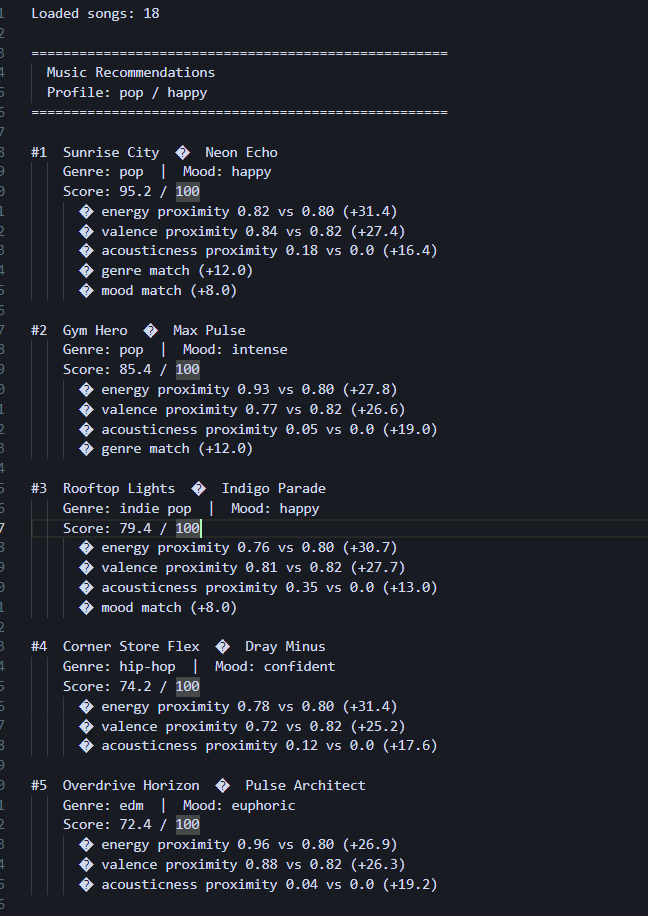
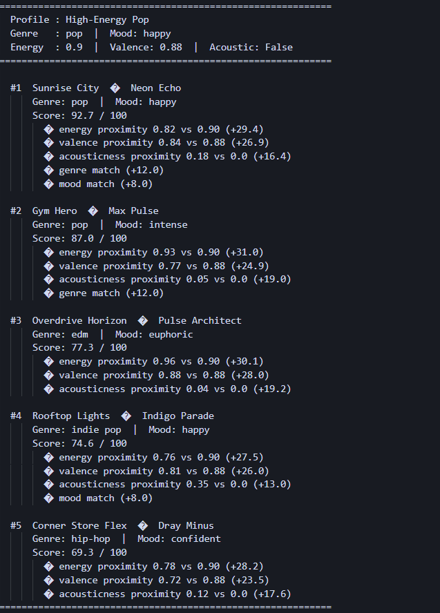
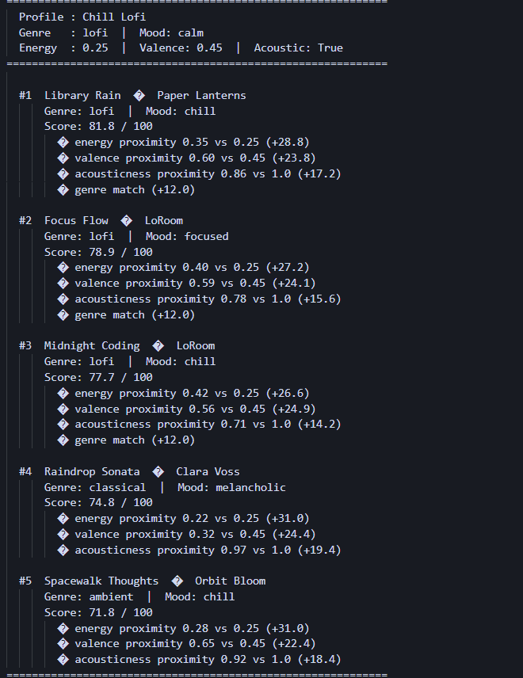
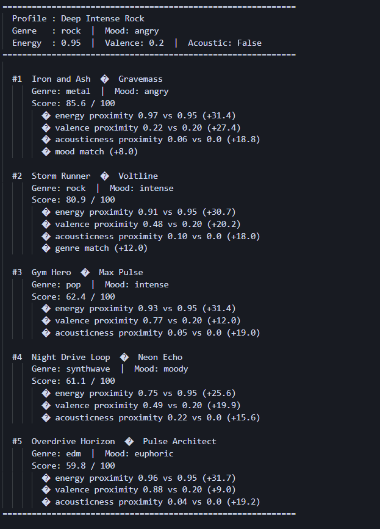
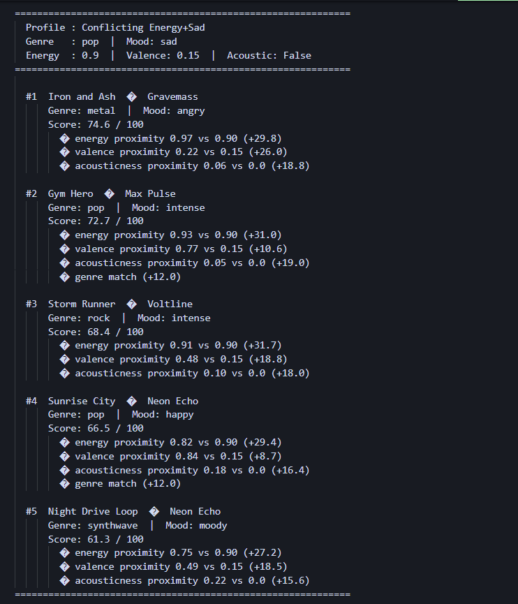
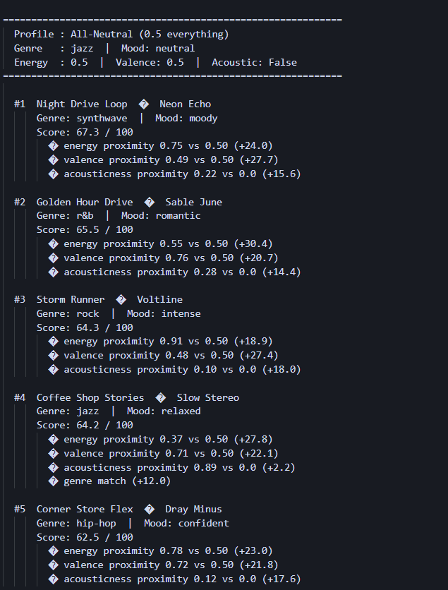
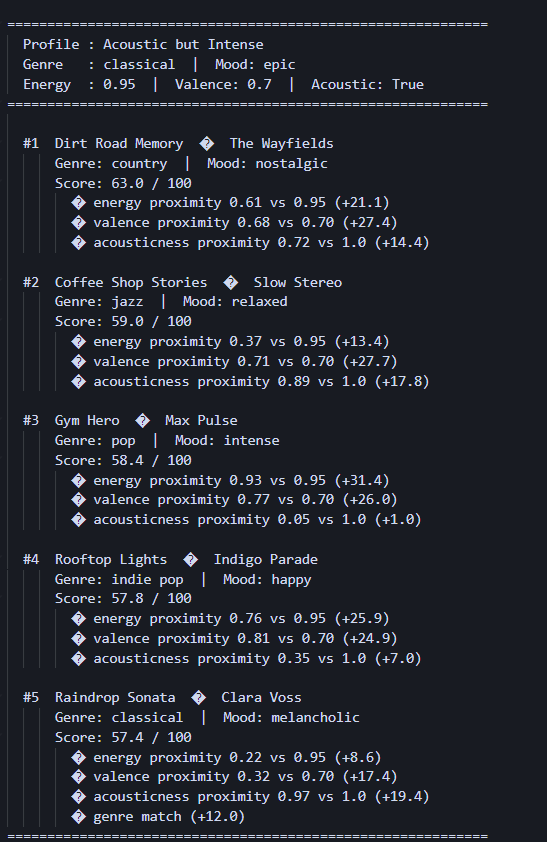

# 🎵 Music Recommender Simulation

## Project Summary

In this project you will build and explain a small music recommender system.

Your goal is to:

- Represent songs and a user "taste profile" as data
- Design a scoring rule that turns that data into recommendations
- Evaluate what your system gets right and wrong
- Reflect on how this mirrors real world AI recommenders

Replace this paragraph with your own summary of what your version does.

---

## How The System Works

You give it a taste profile — your preferred genre, mood, and energy level — and it scores every song in the CSV against that. Higher score = better match. Top 5 get returned.

**Algorithm Recipe:**

1. Start every song at 0 points
2. +2.0 if genre matches your preference
3. +1.0 if mood matches
4. up to +3.0 based on how close the song's energy is to your target
5. up to +2.0 for valence (emotional tone) closeness
6. up to +1.0 for acousticness — electric songs score higher if you set `likes_acoustic: False`

After scoring all songs, drop anything below 40, sort the rest, return top 5.

**Potential biases:**

- Genre gets a flat +2.0 bonus no matter what, so a slow boring rock song could beat a great lofi track just because the genre label matches
- The system only sees numbers — two songs with the same energy value could feel completely different in real life
- The catalog is only 18 songs and leans toward certain genres, so niche tastes won't be served well

---

## Getting Started

### Setup

1. Create a virtual environment (optional but recommended):

   ```bash
   python -m venv .venv
   source .venv/bin/activate      # Mac or Linux
   .venv\Scripts\activate         # Windows

2. Install dependencies

```bash
pip install -r requirements.txt
```

3. Run the app:

```bash
python -m src.main
```

### Running Tests

Run the starter tests with:

```bash
pytest
```

You can add more tests in `tests/test_recommender.py`.

---

## Experiments You Tried

- **Doubled energy weight, halved genre bonus** — things broke fast. So many songs hit the 100-point cap that the rankings became meaningless. Proved energy was already too dominant before I touched anything.
- **Tested 6 user profiles** — three normal ones (High-Energy Pop, Chill Lofi, Deep Intense Rock) and three designed to break the system (conflicting preferences, all-neutral targets, acoustic but intense). The weird ones found the real bugs.
- **Conflicting Energy+Sad profile** — asked for sad pop, got a metal track at #1. Technically correct math, completely wrong vibe.

---

## Limitations and Risks

- Only 18 songs — niche genre fans basically have no real options
- Energy makes up 40% of the score, so it can override everything else
- Genre matching is all-or-nothing — "indie pop" gets zero credit for a "pop" user
- The acoustic preference is a yes/no switch, not a scale — no nuance
- The system has no idea that certain feature combinations don't make sense together (high energy + sad mood)

---

## Reflection

Read and complete `model_card.md`:

[**Model Card**](model_card.md)

Write 1 to 2 paragraphs here about what you learned:

- about how recommenders turn data into predictions
- about where bias or unfairness could show up in systems like this


---

## 7. `model_card_template.md`

Combines reflection and model card framing from the Module 3 guidance. :contentReference[oaicite:2]{index=2}  

```markdown
# 🎧 Model Card - Music Recommender Simulation

## 1. Model Name

Give your recommender a name, for example:

> VibeFinder 1.0

---


## 2. Intended Use

- What is this system trying to do
- Who is it for

Example:

> This model suggests 3 to 5 songs from a small catalog based on a user's preferred genre, mood, and energy level. It is for classroom exploration only, not for real users.

---

## 3. How It Works (Short Explanation)

Describe your scoring logic in plain language.

- What features of each song does it consider
- What information about the user does it use
- How does it turn those into a number

Try to avoid code in this section, treat it like an explanation to a non programmer.

---

## 4. Data

Describe your dataset.

- How many songs are in `data/songs.csv`
- Did you add or remove any songs
- What kinds of genres or moods are represented
- Whose taste does this data mostly reflect

---

## 5. Strengths

Where does your recommender work well

You can think about:
- Situations where the top results "felt right"
- Particular user profiles it served well
- Simplicity or transparency benefits

---

## 6. Limitations and Bias

Where does your recommender struggle

Some prompts:
- Does it ignore some genres or moods
- Does it treat all users as if they have the same taste shape
- Is it biased toward high energy or one genre by default
- How could this be unfair if used in a real product

---

## 7. Evaluation

How did you check your system

Examples:
- You tried multiple user profiles and wrote down whether the results matched your expectations
- You compared your simulation to what a real app like Spotify or YouTube tends to recommend
- You wrote tests for your scoring logic

You do not need a numeric metric, but if you used one, explain what it measures.

---

## 8. Future Work

If you had more time, how would you improve this recommender

Examples:

- Add support for multiple users and "group vibe" recommendations
- Balance diversity of songs instead of always picking the closest match
- Use more features, like tempo ranges or lyric themes

---

## 9. Personal Reflection

A few sentences about what you learned:

- What surprised you about how your system behaved
- How did building this change how you think about real music recommenders
- Where do you think human judgment still matters, even if the model seems "smart"


phase 3




phase 4:








