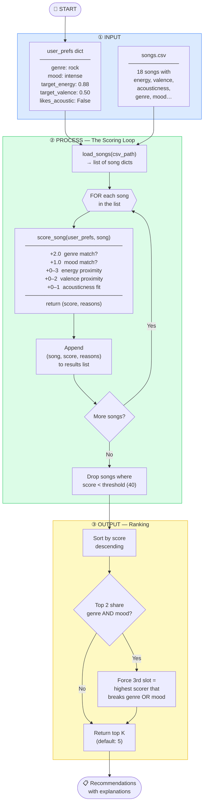

# Step 4: Data Flow Visualization

## Mental Map (plain text)

```
INPUT                  PROCESS                          OUTPUT
─────────────────      ──────────────────────────────   ─────────────────
user_prefs dict   ──►  Load songs.csv into a list   
songs.csv         ──►  │                            
                        ▼                            
                        FOR each song in the list:   
                          score = 0                  
                          +2.0  if genre matches     
                          +1.0  if mood matches      
                          +0–3  energy proximity     
                          +0–2  valence proximity    
                          +0–1  acousticness fit     
                          store (song, score)        
                        END LOOP                     
                        │                            
                        ▼                            
                        Drop scores < threshold      
                        Sort descending by score     
                        Apply diversity rule         ──►  Top 5 recommendations
                                                          with explanations
```

---

## Mermaid.js Flowchart



---

## How a Single Song Moves Through the System

Using **"Storm Runner"** (rock · intense · energy=0.91 · valence=0.48 · acousticness=0.10)
against the user profile (rock · intense · target_energy=0.88 · target_valence=0.50 · likes_acoustic=False):

| Step | Action | Running Score |
|---|---|---|
| Load | Song read from songs.csv into a dict | — |
| Genre check | `"rock" == "rock"` → +2.0 | **2.0** |
| Mood check | `"intense" == "intense"` → +1.0 | **3.0** |
| Energy proximity | `(1 - \|0.91 - 0.88\|) × 3.0 = 0.97 × 3.0` → +2.91 | **5.91** |
| Valence proximity | `(1 - \|0.48 - 0.50\|) × 2.0 = 0.98 × 2.0` → +1.96 | **7.87** |
| Acousticness fit | `likes_acoustic=False`, song=0.10 (low) → +1.0 | **8.87** |
| Threshold check | 8.87 ≥ threshold → **keep** | ✅ |
| Sort | Placed in ranked list by score | — |
| Return | Appears in top 5 | **Recommended** |
